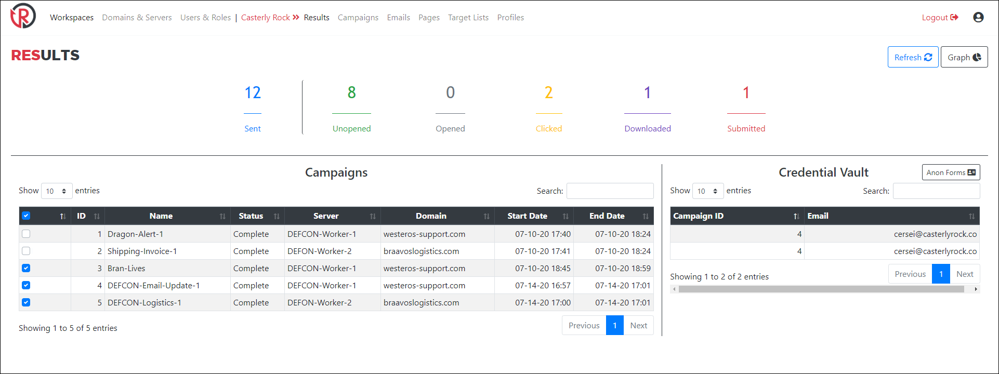

# Results
The results page shows your overall statistics for campaigns run in the current workspace. By clicking on any of the tracked categories (i.e. Sent, Clicked, etc.) you can see a table with details. Clicking a row in any of these tables will drill down so you can see specific event details for the target, including timestamps, IPs and user-agents.

Tracked categories are defined below:
* __Error__ - Email tied to these result objects failed to send. Likely indicative of a profile (SMTP) configuration issue.
* __Scheduled__ - Emails tied to these results objects have not sent yet, but are in the queue to send.
* __Sent__ - Emails tied to these result objects have sent. (This category's value is equal to the sum of the values for Unopened, Opened, Clicked, Downloaded, and Submitted.)
* __Unopened__ - A unique GET request tied back to these result objects has not been received for the hosted 1x1 pixel image contained in the sent emails.
* __Opened__ - A unique GET request tied back to these result objects has been received for the hosted 1x1 pixel image contained in the sent emails.
* __Clicked__ - A unique GET request tied to these result objects has been received for at least one hosted phishing page.
* __Downloaded__ - A unique GET request tied to these result objects has been received for the configured payload URL.
* __Submitted__ - A unique POST request tied to these result objects has been received.

The five categories below Sent (to the right of Sent in the client UI) are exclusive, as in one result object cannot fall into more than one category (i.e. results in Clicked will not also appear in Opened). This is my preferred method of statistic tracking as it allows for easy visuals in reporting. Obviously, if a user has submitted form data, they have previously opened the email and clicked a link.

## Captured Form Data
The credential vault contains form data submitted by your phishing targets. Click a row to drill down to the actual form values that were submitted.

redlure will also capture data submitted without a tracking ID (submissions that do not trace back to one of your targets). This data is visible by clicking the anonymous forms button.